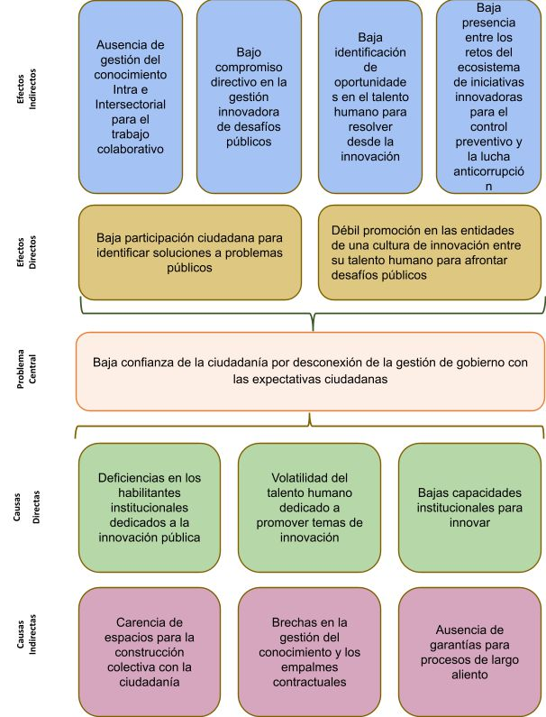

# Meta-Analisis-IIP
Este repositorio genera y almacena los grandes hallazgos en relación al IIP 2023. Al interior de la carpeta gráficos encontrará las imágenes. Cada una de ellas responde a problemáticas descubiertas con una matriz de vestel. El diagrama de arbol de abajo es el punto de inicio.

# Análisis por sección:

## Efectos Indirectos:
1. Ausencia de gestión del conocimiento intra e intersectorial para el trabajo colaborativo.
2. Bajo compromiso directivo en la gestión innovadora de desafíos públicos.
3. Baja identificación de oportunidades en el talento humano para resolver desde la innovación.
4. Baja presencia entre los retos del ecosistema de iniciativas innovadoras para el control preventivo y la lucha anticorrupción.

## Efectos Directos:
1. Baja participación ciudadana para identificar soluciones a problemas públicos.
    - 
    - 
2. Débil promoción en las entidades de una cultura de innovación entre su talento humano para afrontar desafíos públicos.
    - 

## Problema Cental:
1. Baja confianza de la ciudadanía por desconeción de la gestión de gobierno con las expectativas ciudadanas.

## Causas Directas:
1. Deficiencias en los habilitantes institucionales dedicados a la innovación pública.
2. Volatilidad del talento humano dedicado a promover temas de innovación.

## Causas Indirectas:
1. Carencia de espacios para la construcción colectiva con la ciudadanía.
    - 
    - 
2. Brechas en la gestión del conocimiento y los empalmes contractuales.
    - 
3. Ausencia de garantías para procesos de largo aliento.
    - 
    - 
